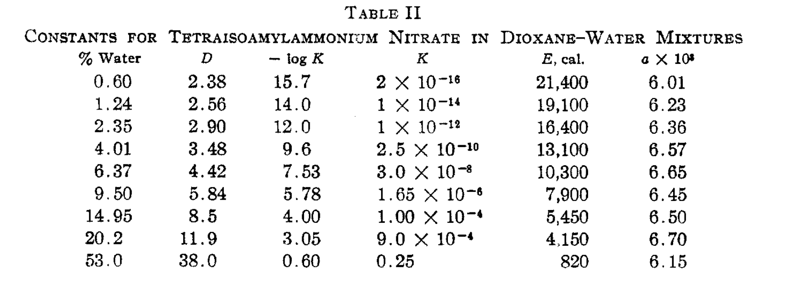

# quick-fuoss

*rapid estimation of ion-pair dissociation constants*

### Description

*quick-fuoss* is an open-source Python 3 program designed to allow for quick estimation of ion-pair dissociation constants.
To run, *quick-fuoss* requires only the name of the cation and anion and the dielectric constant of the solvent in question.
Alternatively, `.xyz` files can be supplied.

*quick-fuoss* requires a working installation of [cctk](https://cctk.readthedocs.io/en/latest/).

### Theory

As the name implies, *quick-fuoss* uses the Fuoss model for modelling association/dissociation of idealized spherical ions in implicit solvent.<sup>1</sup>
This approach is purely Coulombic and neglects any specific ion/ion interactions, as well as inner-sphere solvent effects (e.g. solvent coordination to transition metals). 
Nevertheless, these approximations are reasonably satisfied for many common ion pairs.

This model has been used to correct p*K*a values in relatively non-polar solvents: the present implementation is based on that literature.<sup>2,3</sup>

### Usage

*quick-fuoss* can be used starting from either the names of the ions in question (requires Internet access) or `.xyz` files. Some examples are shown below:

```
# Kd for sodium chloride in a solvent with dielectric constant 40
$ python quick_fuoss.py sodium chloride 40

# the same, but at -78 ºC
$ python quick_fuoss.py --temp 195 sodium chloride 40

# Kd of the chloride salt of cation.xyz in a solvent with dielectric constant 80
$ python quick_fuoss.py cation.xyz chloride 80

# Kd of the salt formed by combining cation.xyz and anion.xyz in a solvent with dielectric constant 12
$ python quick_fuoss.py cation.xyz anion.xyz 12
```

### Testing

The calculated values are in reasonable agreement with reported values<sup>4</sup>, as seen below:



```
$ python quick_fuoss.py tetraisoamylammonium nitrate 8.5
Reading ion #1 from rdkit...
Reading ion #2 from rdkit...
Dissociation constant:	0.00004930 M
$ python quick_fuoss.py tetraisoamylammonium nitrate 11.9
Reading ion #1 from rdkit...
Reading ion #2 from rdkit...
Dissociation constant:	0.00094706 M
```
To test that the program is working correctly, simply run:

```
$ python test.py
All tests successful! (9 tests run in 14.91 seconds)
```

### References

1. Fuoss, R. M. Ionic Association III: The Equilibrium between Ion Pairs and Free Ions. *J. Am. Chem. Soc.* **1958**, *80*, 5059.
2. Abdur-Rashid, K. et al. An Acidity Scale for Phosphorus-Containing Compounds Including Metal Hydrides and Dihydrogen Complexes in THF: Toward the Unification of Acidity Scales. *J. Am. Chem. Soc.* **2000**, *122*, 9155.
3. Paenurk, E. et al. A unified view to Brønsted acidity scales: do we need solvated protons? *Chem. Sci.* **2017**, *8*, 6964.
4. Fuoss, R. M; Kraus, C. A. Properties of Electrolytic Solutions. III. The Dissociation Constant. *J. Am. Chem. Soc.* **1933**, *55*, 1019.

### Authors:

*quick-fuoss* was written by Corin Wagen (Harvard University). Please email `cwagen@g.harvard.edu` with any questions or bug reports.

### How to Cite:

Wagen, C.C. *quick-fuoss* **2020**, [www.github.com/corinwagen/quick-fuoss](https://www.github.com/corinwagen/quick-fuoss).

### License:

This project is licensed under the Apache License, Version 2.0.  Please see `LICENSE` for full terms and conditions.


*Copyright 2020 by Corin Wagen*
